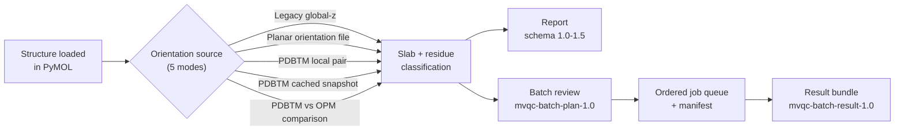

<div align="center">

<picture>
  <source media="(prefers-color-scheme: dark)" srcset="docs/assets/brand/wordmark-on-dark.svg">
  
</picture>

**Membrane-aware visual QC for PyMOL structures.**

[](https://github.com/TrPavel/membrane-visual-qc/actions/workflows/ci.yml)
[](https://github.com/TrPavel/membrane-visual-qc/releases)
[](LICENSE)


[Install](#12-installation-and-upgrade) ·
[Quick start](#5-quick-start) ·
[Documentation](docs/index.md) ·
[Latest release](https://github.com/TrPavel/membrane-visual-qc/releases/latest)

</div>

> Membrane Visual QC is a review assistant. It does not prove that a structure is correct, stable,
> membrane-inserted, or experimentally validated -- see [Scientific interpretation](#9-scientific-interpretation).

Distributed as a **GitHub prerelease** (not on PyPI). Current published release: **v0.8.0**.
Active development line: **`0.9.0.dev0`**.

## 1. What it does

An open-source PyMOL plugin that displays an explicit membrane slab or orientation source next to
a structure, classifies residues by position (core / interface / outside), flags charged and
selected polar core residues for manual review, colors by a coarse hydropathy palette, and selects
residues near a ligand/cofactor selection. Every run exports a versioned JSON report and a
deterministic CSV alongside it. None of this is a biological verdict -- see
[docs/status_vocabulary.md](docs/status_vocabulary.md) for exactly what every status literal it
produces does and does not mean.

## 2. Why it exists

Visually inspecting where a structure sits relative to a membrane, and which charged/polar
residues land in the hydrophobic core, is a routine manual step in structural review -- one that's
easy to do inconsistently by eye and tedious to repeat across many structures. Membrane Visual QC
makes that specific, bounded check repeatable, exportable, and batchable, without claiming to
replace scientific judgment about the result.

## 3. Visual workflow



A real, current-GUI screenshot and short demo are not yet available in this repository's own
environment -- see [docs/screenshot_capture_plan.md](docs/screenshot_capture_plan.md) for the
exact, reproducible plan to capture them from a real PyMOL session.

## 4. Core workflows

| Mode | Input | What it checks |
|---|---|---|
| **Legacy global-z** | selection, `zmin`/`zmax` | Original global-z slab; the membrane normal is assumed to be the global z-axis. |
| **Planar orientation** | local orientation JSON | An arbitrary planar membrane normal from a versioned local file, not just global z. |
| **PDBTM local** | local PDBTM API-v1 pair | Reviewed offline PDBTM applicability against the structure's current coordinates. |
| **PDBTM cache** | validated local cache snapshot | The same applicability check via an explicit **Fetch/Refresh** vs. **Use cached pair** boundary -- see [Safety and reproducibility](#8-safety-and-reproducibility). |
| **PDBTM vs. OPM comparison** | PDBTM pair + local OPM file | An independent two-source geometric comparison: no fitting, no automatic source choice, no consensus, no provider ranking. |
| **Batch review** | `mvqc-batch-plan-1.0` plan | Runs any of the above across many jobs sequentially on PyMOL's main thread, with cooperative cancellation and a manifest. |

Full walkthroughs: [docs/tutorial.md](docs/tutorial.md) (each mode individually) and
[docs/five_mode_walkthrough.md](docs/five_mode_walkthrough.md) (one narrated example exercising all
five plus Batch review).

## 5. Quick start

```bash
conda env create -f environment.yml
conda activate mvqc
```

```pml
run load_mvqc.py
load data/synthetic/bad_core_lys.pdb, bad_core_lys
mvqc_check selection=bad_core_lys, zmin=-15, zmax=15, ligand=, cutoff=5.0
mvqc_export path=reports/bad_core_lys_mvqc.json
```

The synthetic fixture must produce exactly one charged-core review item -- this verifies software
behavior, not biology. Full walkthrough: [docs/quick_start.md](docs/quick_start.md).

<details>
<summary>All PyMOL commands</summary>

- `mvqc_check selection=all, zmin=-15, zmax=15, ligand=organic, cutoff=5.0`
- `mvqc_check_orientation selection=all, orientation_file=demo/rotated_1ubq_orientation.json`
- `mvqc_slab_orientation selection=all, orientation_file=demo/rotated_1ubq_orientation.json`
- `mvqc_check_pdbtm selection=all, pdbtm_json=C:/payloads/1pcr.json, transformed_pdb=C:/payloads/1pcr.trpdb`
- `mvqc_slab_pdbtm selection=all, pdbtm_json=C:/payloads/1pcr.json, transformed_pdb=C:/payloads/1pcr.trpdb`
- `mvqc_slab zmin=-15, zmax=15`
- `mvqc_color_hydropathy selection=all`
- `mvqc_ligand_shell protein=all, ligand=organic, cutoff=5.0`
- `mvqc_export path=reports/mvqc_report.json`
- `mvqc_batch_run plan=data/synthetic/stage5a_batch_plan.json, output_dir=reports/batch, fail_fast=0, quiet=1`
- `mvqc_clear` -- removes only plugin-owned names beginning with `mvqc_`; a failed analysis clears
  partial plugin output so stale visuals never appear current.

The offline PDBTM commands require an explicit matching local JSON/transformed-PDB pair and
exactly one single-state PyMOL molecular object; the plugin never fetches data, fits, rotates,
translates, or otherwise transforms the input object, and never serializes local paths into the
report. See [docs/pdbtm_offline_import.md](docs/pdbtm_offline_import.md).

</details>

## 6. Example output

A real Batch review run (owner-tested against the published v0.8.0 build) produced:

| Job outcome | Count | Meaning |
|---|---:|---|
| `SUCCESS` | 3 | Completed with no flagged review items. |
| `REVIEW_ITEMS` | 1 | Completed; one or more residues flagged for manual review. |
| `INPUT_REJECTED` | 1 | Failed pre-execution plan validation; no analysis ran at all. |
| **Overall run** | `COMPLETED_WITH_ERRORS` | At least one job failed under `continue_on_error`; every other job's output remains valid and independently readable. |

`REVIEW_ITEMS` and `INPUT_REJECTED` are not failure states to "fix until they disappear" -- they
are specific, typed outcomes with their own recommended next action. The complete vocabulary,
including single-structure report statuses, cache/provider error codes, and GUI states, is one
canonical table: [docs/status_vocabulary.md](docs/status_vocabulary.md).

## 7. Documentation map

Start at [docs/index.md](docs/index.md) for the full map (grouped into Using the plugin,
Reference, Scientific boundaries, Installation and maintenance, Developer/release) with a
recommended reading path for first-time users, batch users, developers, and reviewers. Most-used
guides directly:

- **Outputs**: [docs/outputs_and_manifests.md](docs/outputs_and_manifests.md) (batch output/manifest layout),
  [docs/batch_plan_reference.md](docs/batch_plan_reference.md) (batch-plan field reference).
- **Troubleshooting**: [docs/troubleshooting.md](docs/troubleshooting.md), organized by symptom.
- **Scientific boundaries**: [docs/known_limitations.md](docs/known_limitations.md),
  [docs/scientific_interpretation.md](docs/scientific_interpretation.md).
- **Contract and release governance**: [docs/v1.0_contract_freeze.md](docs/v1.0_contract_freeze.md),
  [docs/versioning_policy.md](docs/versioning_policy.md), [docs/release_checklist.md](docs/release_checklist.md).
- **Visual identity**: [docs/visual_identity.md](docs/visual_identity.md) (this README's own design
  conventions, for contributors).

## 8. Safety and reproducibility

- **Coordinates are never mutated.** No mode fits, rotates, translates, or otherwise transforms
  the loaded object; applicability checks are identity-only against the object's current
  coordinates. See [docs/offline_and_safety.md](docs/offline_and_safety.md).
- **Explicit network boundary.** Only an explicit **Fetch/Refresh** action in the PDBTM-cache mode
  ever makes a bounded, direct HTTPS request; **Use cached pair** and every other mode make no
  network call at all. No proxy, PAC, CONNECT, or redirect support -- see
  [docs/offline_and_safety.md](docs/offline_and_safety.md).
- **Atomic output publication.** Batch execution writes to a temporary path and publishes the
  final report/manifest atomically; a failed or cancelled job cannot leave a half-written file at
  its declared output path.
- **Session-only history.** The Batch review tab's run history (at most 20 entries) lives only in
  the dialog's memory for as long as PyMOL stays open; nothing is written to disk beyond the
  reports/manifests you explicitly export.
- **Deterministic outputs.** Reports and the Plugin ZIP itself build byte-identically from the
  same source commit -- verified on every release; see [Release verification](#13-release-verification).

## 9. Scientific interpretation

Report schemas 1.0-1.5 and the `mvqc-batch-plan-1.0` / `mvqc-batch-result-1.0` contracts describe
what the software did, not a biological judgment. In particular: `REVIEW_ITEMS` does not mean a
residue is wrong; PDBTM/OPM applicability is geometric evidence, not proof an orientation is
biologically correct; ordinary SASA is not lipid accessibility; and there is no automatic source
ranking, consensus, or biological-correctness verdict anywhere in this project. Full boundary:
[docs/scientific_interpretation.md](docs/scientific_interpretation.md) and
[docs/known_limitations.md](docs/known_limitations.md).

## 10. Compatibility

Primary development and all graphical/manual acceptance to date target **Windows** with
**Incentive PyMOL 3.1.8**; the pure-Python logic is additionally tested cross-platform on
`ubuntu-latest` in CI, but no manual graphical acceptance has been performed on Linux or macOS, and
no other PyMOL distribution has been manually verified. Report schemas 1.0-1.5 and the batch
contracts are unchanged since their introduction. Full grid (platform x validation method, schema
support per release, verified upgrade paths): [docs/compatibility_matrix.md](docs/compatibility_matrix.md);
prose statement: [docs/compatibility.md](docs/compatibility.md).

## 11. Current limitations

OPM is offline-only; direct PDBTM retrieval does not support proxies, PAC, CONNECT, redirects, or
retries. There is no automatic cache migration, garbage collection, persistent batch history,
visual batch-plan editor, curved/multiple-membrane model, automatic fitting, automatic source
selection, provider ranking, consensus, or biological-correctness verdict. Complete, release-by-
release list: [docs/known_limitations.md](docs/known_limitations.md).

## 12. Installation and upgrade

Download `MembraneVisualQC-0.8.0.zip` and its `.zip.sha256` checksum from the
[v0.8.0 GitHub prerelease](https://github.com/TrPavel/membrane-visual-qc/releases/tag/v0.8.0),
verify the checksum, install through PyMOL Plugin Manager using **clean replacement** (recommended
over overlay), and fully restart PyMOL before opening **Plugin > Membrane Visual QC**. GitHub
Releases is the only distribution channel; this project is not published to PyPI.

Upgrading an existing installation is a different situation from a first install -- see
[docs/upgrade_guide.md](docs/upgrade_guide.md) for the recommended method, data-compatibility
notes, and troubleshooting. Verified upgrade evidence:

- v0.6.0 -> `0.7.0.dev0`: automated harness + owner-observed manual clean-install/upgrade/rollback
  PASS -- [docs/manual_install_upgrade_checklist.md](docs/manual_install_upgrade_checklist.md).
- v0.7.0 -> v0.8.0: owner-observed manual smoke-test PASS (not the same dedicated harness) --
  [docs/v0.8.0_install_upgrade_manual_evidence.json](docs/v0.8.0_install_upgrade_manual_evidence.json).
- Any other version pair: **not verified** -- see
  [docs/compatibility_matrix.md](docs/compatibility_matrix.md) before assuming support.

<details>
<summary>Source development setup</summary>

```bash
conda env create -f environment.yml
conda activate mvqc
```

Start PyMOL in the checkout root and run `run load_mvqc.py`. Do not execute
`membrane_vqc/commands.py` directly: it is a package module and uses relative imports. If the
exact `pymol-open-source=3.1.0` pin is unavailable, use a compatible build and record the tested
version.

</details>

## 13. Release verification

Every release's exact publication evidence -- release PR/squash commit, post-merge CI run, the
annotated tag's object and target, the GitHub prerelease URL/timestamp, and all four asset
size/SHA-256 pairs -- is frozen in `docs/vX.Y.Z_release_evidence.json` and independently
re-verified byte-identical after publication; every release also confirms no PyPI publication
occurred. See [docs/v0.8.0_release_evidence.json](docs/v0.8.0_release_evidence.json) for the
current release and [docs/release_checklist.md](docs/release_checklist.md) for the process.

## 14. Citation, acknowledgement, and license

MIT-licensed. No formal citation is available yet; cite `membrane-vqc-pymol` and the exact version
used. The implementation is clean-room and does not copy GPL PyMOL plugin code.

## 15. Development status and roadmap

Development is currently at **`0.9.0.dev0`**, reopened after publishing v0.8.0 (a contract-freeze
and documentation-consolidation release -- see [docs/v0.8.0_release_notes.md](docs/v0.8.0_release_notes.md)
and [docs/v1.0_contract_freeze.md](docs/v1.0_contract_freeze.md)). The current session's own scope
is this visual-identity/README pass; it changes no runtime, scientific, batch, schema, contract,
or cache-format behavior, and does not redesign the plugin GUI itself. Next: GUI/UX polish,
followed by continued hardening toward a stable v1.0. Full history:
[docs/development_state.md](docs/development_state.md) and [CHANGELOG.md](CHANGELOG.md).
