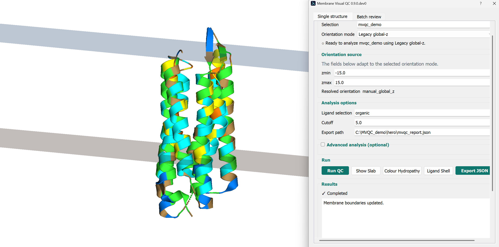
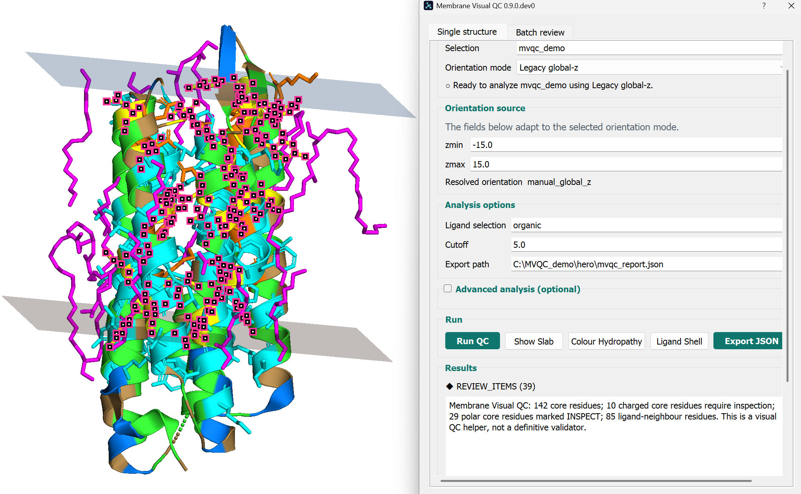
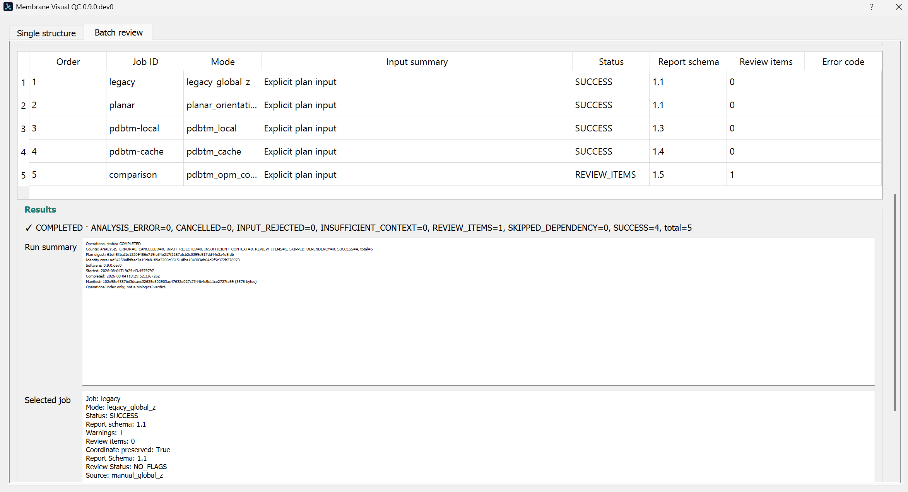
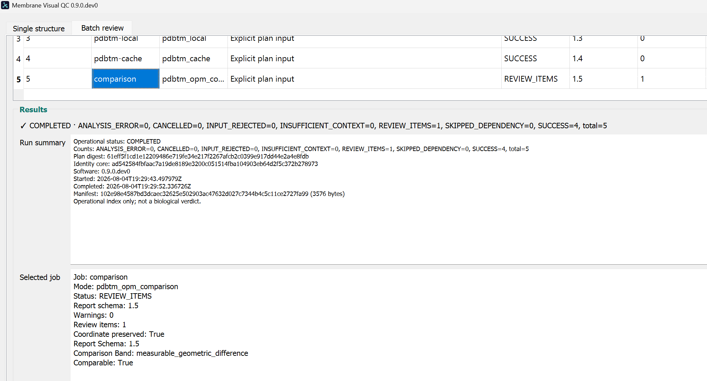
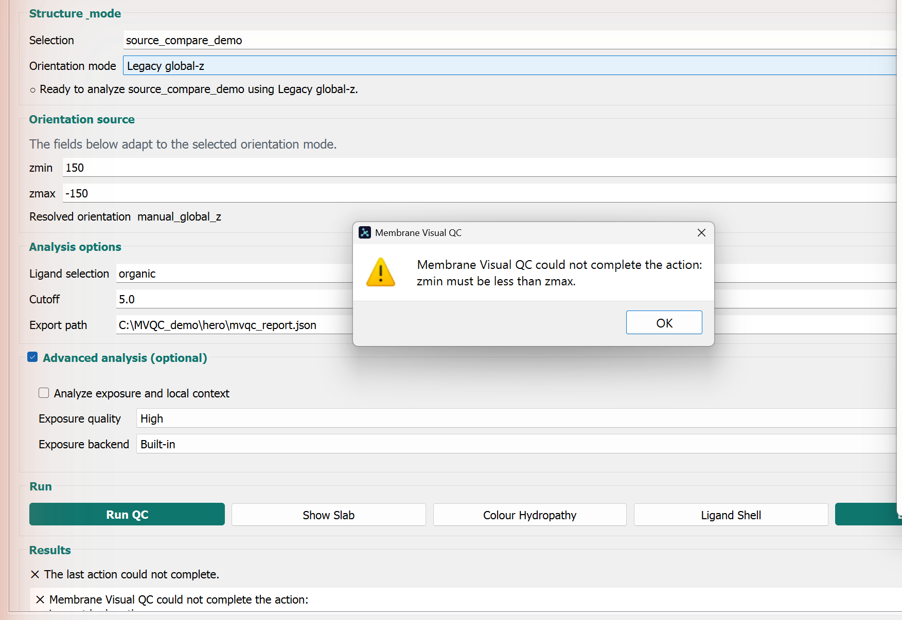
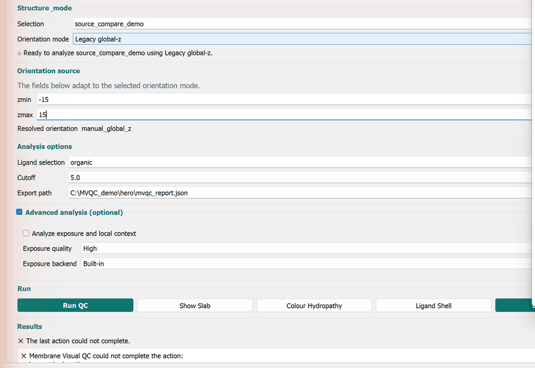
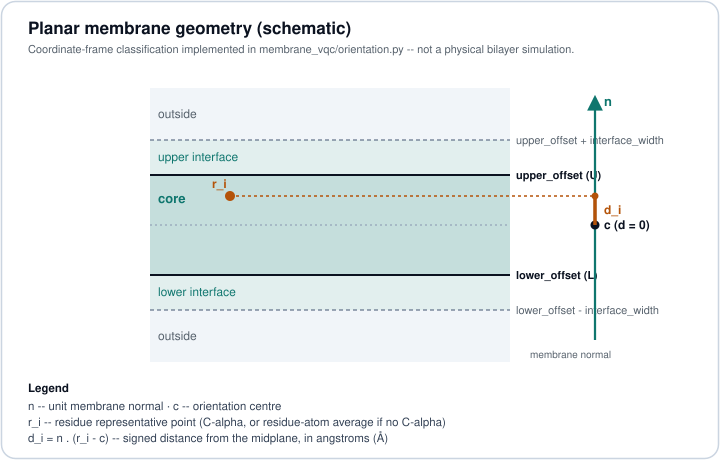
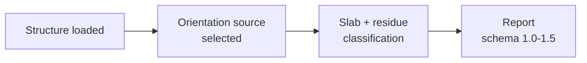
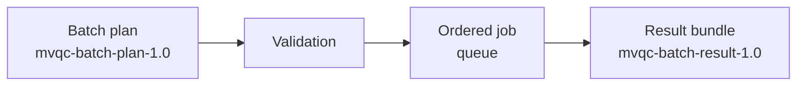

<div align="center">

<picture>
  <source media="(prefers-color-scheme: dark)" srcset="docs/assets/brand/wordmark-on-dark.svg">
  
</picture>

**Membrane-aware visual QC for PyMOL structures.**

[](https://github.com/TrPavel/membrane-visual-qc/actions/workflows/ci.yml)
[](https://github.com/TrPavel/membrane-visual-qc/releases)
[](LICENSE)


[](https://doi.org/10.5281/zenodo.21999555)
[](https://bio.tools/membrane_visual_qc)


[Install](#installation-and-compatibility) ·
[Quick start](#quick-start) ·
[Scientific foundation](#scientific-foundation) ·
[Documentation](docs/index.md) ·
[Latest release](https://github.com/TrPavel/membrane-visual-qc/releases/latest)

</div>

> Membrane Visual QC is a review assistant. It does not prove that a structure is correct, stable,
> membrane-inserted, or experimentally validated -- see [Scientific interpretation](docs/scientific_interpretation.md).

Distributed as a **stable GitHub Release** (not on PyPI). Current published release: **v1.0.0**,
the owner-accepted first stable Membrane Visual QC release.

<p align="center">
  
</p>

<p align="center"><sub>Single structure tab, <strong>Legacy global-z</strong> mode -- a manually defined <code>zmin</code>/<code>zmax</code> slab, not a source-derived PDBTM/OPM orientation (real screenshot, own capture against the current UI).</sub></p>

## v1.0 video walkthrough

<p align="center">
  <a href="https://youtu.be/lowQey_D610?si=y5jtr_AV41XB0qLA">
    
  </a>
</p>

<p align="center"><strong><a href="https://youtu.be/lowQey_D610?si=y5jtr_AV41XB0qLA">I Built a PyMOL Plugin for Membrane Protein Quality Control</a></strong></p>

A user-facing walkthrough of the released software: scientific motivation, membrane-aware QC,
hydropathy and ligand context, orientation provenance, Batch Review, PDBTM-OPM comparison, and the
path to the stable v1.0 release. The video is not formal scientific evidence or part of the frozen
v1.0.0 release evidence.

## External records and project story

- [Zenodo DOI](https://doi.org/10.5281/zenodo.21999555) provides a durable archive and citation
  record for the exact stable v1.0.0 software release.
- [bio.tools](https://bio.tools/membrane_visual_qc) lists the project in its life-science software
  registry as `biotools:membrane_visual_qc`; registration is not certification or endorsement.
- [The Missing Coordinate Frame: Building Membrane Visual QC](https://paveltrofimchik.substack.com/p/the-missing-coordinate-frame-building)
  is a non-canonical long-form development and methodology write-up.

The repository documentation, contracts, and frozen release evidence remain canonical. The article
and video are explanatory resources, not peer-reviewed publications or scientific validation.

## Real product preview

Owner-captured, current-UI screenshots (against `0.9.0.dev0`, the dialog restructured across three
real-PyMOL-reviewed passes most recently merged in [PR #37](https://github.com/TrPavel/membrane-visual-qc/pull/37)):

<p align="center">
  
</p>

<p align="center"><sub>A completed run with ligand-shell residues highlighted and 39 flagged review items -- <code>REVIEW_ITEMS</code> is a manual-review cue, not an error; see <a href="docs/status_vocabulary.md">status vocabulary</a>.</sub></p>

<p align="center">
  
</p>

<p align="center"><sub>This <code>0.9.0.dev0</code> run of the five-mode plan completed 4 jobs and flagged 1 for review (overall <code>COMPLETED</code>). The separately documented v0.8.0 run below hit one <code>INPUT_REJECTED</code> job instead (<code>COMPLETED_WITH_ERRORS</code>) -- both are real, typed operational outcomes, not a pass/fail score; see <a href="#real-example-output">Real example output</a>.</sub></p>

<p align="center">
  
</p>

<p align="center"><sub>The PDBTM-OPM comparison job's own result (captured from Batch review's Selected job panel). The comparison never selects a preferred source or constructs a consensus -- see <a href="#scientific-foundation">Scientific foundation</a>.</sub></p>

<p align="center">
  
</p>

<p align="center"><sub>An invalid <code>zmin</code>/<code>zmax</code> pair is rejected with a clear, typed message before any analysis runs -- no raw traceback.</sub></p>

<p align="center">
  
</p>

<p align="center"><sub>A 3-frame slideshow assembled from real, individually captured states -- structure/mode ready -&gt; <code>Run QC</code> result -&gt; Batch review -- not a continuous screen recording; see <a href="docs/screenshot_capture_plan.md">docs/screenshot_capture_plan.md</a> for exactly how it was built.</sub></p>

Capture provenance and exact composition for every image above: [docs/screenshot_capture_plan.md](docs/screenshot_capture_plan.md).

## What it does

An open-source PyMOL plugin that displays an explicit membrane slab or orientation source next to a
structure, classifies residues by geometric position (core / interface / outside), flags charged and
selected polar core residues for manual review, colors by a coarse hydropathy palette, and selects
residues near a ligand/cofactor selection. Every run exports a versioned JSON report and a
deterministic CSV. None of this is a biological verdict -- see
[docs/status_vocabulary.md](docs/status_vocabulary.md) for exactly what every status literal does
and does not mean, and [Scientific foundation](#scientific-foundation) below for what's actually
computed.

| Orient | Review | Export / Batch |
|---|---|---|
| Pick one of five orientation sources (manual, file, PDBTM, or a PDBTM-OPM comparison) for a source-derived slab. | Inspect charged/polar core residues, hydropathy coloring, and solvent-accessibility context flagged for manual interpretation. | Export a deterministic JSON/CSV report, or run many structures through **Batch review** with an ordered queue and manifest. |

## Scientific foundation

Membrane Visual QC computes four things, each a deterministic calculation, classification, or
visualization over the coordinates and parameters you supply -- never a prediction or a
machine-learned inference:

1. **Membrane geometry** -- an orientation source resolves to a center, a unit normal, and a
   core/interface slab (§§2-4 below).
2. **Residue positional classification** -- each residue's representative point is classified
   `core` / `interface` / `outside` by its signed distance from the midplane (§§3-5).
3. **Hydropathy and solvent-accessibility context** -- a fixed hydropathy scale drives coloring;
   Shrake-Rupley SASA/RSA is computed for review, not lipid accessibility (§§6, 9).
4. **Orientation-source evidence** -- PDBTM/OPM applicability is an identity-only geometric check
   against your structure's exact current coordinates, never a fit (§§10-12).

| Symbol | Meaning |
|---|---|
| $r_i$ | residue representative point (C-alpha, or the residue's atom-average if no C-alpha) |
| $c$ | orientation centre |
| $n$ | unit membrane normal |
| $d_i$ | signed distance of $r_i$ from the midplane, in Å |
| $L$, $U$ | `lower_offset`, `upper_offset` (Å, measured along $n$ from $c$) |
| $w$ | `interface_width` (Å) |

Signed distance from the midplane (`orientation.signed_distance`):

$$d_i = n \cdot (r_i - c)$$

The exact implemented classification (`orientation.classify_signed_distance`):

$$
\text{classification}(d_i) =
\begin{cases}
\texttt{core} & L \le d_i \le U \\
\texttt{lower\_interface} & L-w \le d_i < L \\
\texttt{upper\_interface} & U < d_i \le U+w \\
\texttt{outside} & \text{otherwise}
\end{cases}
$$

<p align="center">
  
</p>

<p align="center"><sub>Coordinate-frame schematic of the geometry above -- not a physical bilayer simulation.</sub></p>

Full derivation (nearest-boundary/outside-distance/normalized-depth, residue representative points,
hydropathy, SASA backends, PDBTM/OPM applicability, and the PDBTM-OPM comparison), with the exact
function and file backing every claim: **[docs/scientific_background.md](docs/scientific_background.md)**.
Claims boundary and vocabulary: [docs/scientific_interpretation.md](docs/scientific_interpretation.md).

## How it works



The orientation source is one of five modes -- see [Core workflows](#core-workflows) below.



Batch review runs any single-structure mode above across many jobs sequentially, with cooperative
cancellation and a manifest -- see [docs/five_mode_walkthrough.md](docs/five_mode_walkthrough.md).

## Core workflows

| Mode | Input | What it checks |
|---|---|---|
| **Legacy global-z** | selection, `zmin`/`zmax` | Original global-z slab; the membrane normal is assumed to be the global z-axis. |
| **Planar orientation** | local orientation JSON | An arbitrary planar membrane normal from a versioned local file, not just global z. |
| **PDBTM local** | local PDBTM API-v1 pair | Reviewed offline PDBTM applicability against the structure's current coordinates. |
| **PDBTM cache** | validated local cache snapshot | The same applicability check via an explicit **Fetch/Refresh** vs. **Use cached pair** boundary -- see [Safety and scientific boundaries](#safety-and-scientific-boundaries). |
| **PDBTM vs. OPM comparison** | PDBTM pair + local OPM file | An independent two-source geometric comparison: no fitting, no automatic source choice, no consensus, no provider ranking. |
| **Batch review** | `mvqc-batch-plan-1.0` plan | Runs any of the above across many jobs sequentially on PyMOL's main thread. |

Full walkthroughs: [docs/tutorial.md](docs/tutorial.md) (each mode individually) and
[docs/five_mode_walkthrough.md](docs/five_mode_walkthrough.md) (one narrated example exercising all
five plus Batch review).

## Quick start

```bash
conda env create -f environment.yml
conda activate mvqc
```

```pml
run load_mvqc.py
load data/synthetic/bad_core_lys.pdb, bad_core_lys
mvqc_check selection=bad_core_lys, zmin=-15, zmax=15, ligand=, cutoff=5.0
mvqc_export path=reports/bad_core_lys_mvqc.json
```

The synthetic fixture must produce exactly one charged-core review item -- this verifies software
behavior, not biology. Full walkthrough: [docs/quick_start.md](docs/quick_start.md).

<details>
<summary>All PyMOL commands</summary>

- `mvqc_check selection=all, zmin=-15, zmax=15, ligand=organic, cutoff=5.0`
- `mvqc_check_orientation selection=all, orientation_file=demo/rotated_1ubq_orientation.json`
- `mvqc_slab_orientation selection=all, orientation_file=demo/rotated_1ubq_orientation.json`
- `mvqc_check_pdbtm selection=all, pdbtm_json=C:/payloads/1pcr.json, transformed_pdb=C:/payloads/1pcr.trpdb`
- `mvqc_slab_pdbtm selection=all, pdbtm_json=C:/payloads/1pcr.json, transformed_pdb=C:/payloads/1pcr.trpdb`
- `mvqc_slab zmin=-15, zmax=15`
- `mvqc_color_hydropathy selection=all`
- `mvqc_ligand_shell protein=all, ligand=organic, cutoff=5.0`
- `mvqc_export path=reports/mvqc_report.json`
- `mvqc_batch_run plan=data/synthetic/stage5a_batch_plan.json, output_dir=reports/batch, fail_fast=0, quiet=1`
- `mvqc_clear` -- removes only plugin-owned names beginning with `mvqc_`.

The offline PDBTM commands require an explicit matching local JSON/transformed-PDB pair and exactly
one single-state PyMOL molecular object; the plugin never fetches data, fits, rotates, translates,
or otherwise transforms the input object. See [docs/pdbtm_offline_import.md](docs/pdbtm_offline_import.md).

</details>

## Real example output

A real Batch review run (owner-tested against the published v0.8.0 build) produced:

<p align="center"><code>✓ SUCCESS × 3&nbsp;&nbsp;&nbsp;◆ REVIEW_ITEMS × 1&nbsp;&nbsp;&nbsp;✕ INPUT_REJECTED × 1&nbsp;&nbsp;&nbsp;→&nbsp;&nbsp;&nbsp;COMPLETED_WITH_ERRORS</code></p>

| Job outcome | Count | Meaning |
|---|---:|---|
| `SUCCESS` | 3 | Completed with no flagged review items. |
| `REVIEW_ITEMS` | 1 | Completed; one or more residues flagged for manual review. |
| `INPUT_REJECTED` | 1 | Failed pre-execution plan validation; no analysis ran at all. |
| **Overall run** | `COMPLETED_WITH_ERRORS` | At least one job failed under `continue_on_error`; every other job's output remains valid and independently readable. |

`REVIEW_ITEMS` and `INPUT_REJECTED` are specific, typed operational outcomes, not failure states to
"fix until they disappear." Complete vocabulary: [docs/status_vocabulary.md](docs/status_vocabulary.md).

## Safety and scientific boundaries

- **Coordinates are never mutated.** No mode fits, rotates, translates, or otherwise transforms the
  loaded object. **Explicit network boundary**: only **Fetch/Refresh** in PDBTM-cache mode ever
  contacts the network. **Atomic output publication** and **session-only history** (at most 20
  entries, never written to disk). Full mechanism: [docs/offline_and_safety.md](docs/offline_and_safety.md).
- **No biological-correctness verdict, ever.** `REVIEW_ITEMS` flags a residue for manual,
  contextual inspection -- it does not mean a residue is wrong. PDBTM/OPM applicability is geometric
  identity evidence, not proof an orientation is biologically correct. Ordinary SASA is solvent
  accessibility, not lipid accessibility. There is no automatic source ranking, consensus, or
  biological-correctness verdict anywhere in this project. Full boundary:
  [docs/scientific_interpretation.md](docs/scientific_interpretation.md) ·
  [docs/known_limitations.md](docs/known_limitations.md).

## Documentation

Start at [docs/index.md](docs/index.md) for the full map (Using the plugin, Reference, Scientific
boundaries, Installation and maintenance, Developer/release), grouped by reading path. Most-used
guides directly:

- **Video walkthrough**: [*I Built a PyMOL Plugin for Membrane Protein Quality Control*](https://youtu.be/lowQey_D610?si=y5jtr_AV41XB0qLA)
  (user-facing v1.0 software walkthrough).
- **Methods**: [docs/scientific_background.md](docs/scientific_background.md) (implementation-backed
  equations and references), [docs/references.bib](docs/references.bib) (full bibliography).
- **Outputs**: [docs/outputs_and_manifests.md](docs/outputs_and_manifests.md),
  [docs/batch_plan_reference.md](docs/batch_plan_reference.md).
- **Troubleshooting**: [docs/troubleshooting.md](docs/troubleshooting.md).
- **Contract and release governance**: [docs/v1.0_contract_freeze.md](docs/v1.0_contract_freeze.md),
  [docs/versioning_policy.md](docs/versioning_policy.md), [docs/release_checklist.md](docs/release_checklist.md),
  [docs/supply_chain_integrity.md](docs/supply_chain_integrity.md).
- **Visual identity**: [docs/visual_identity.md](docs/visual_identity.md) (this README's own design
  conventions, for contributors).

## Installation and compatibility

Download `MembraneVisualQC-1.0.0.zip` and its `.zip.sha256` checksum from the
[v1.0.0 stable GitHub Release](https://github.com/TrPavel/membrane-visual-qc/releases/tag/v1.0.0),
verify the checksum, install through PyMOL Plugin Manager using **clean replacement**, and fully
restart PyMOL. GitHub Releases is the only distribution channel; this project is not published to
PyPI.

Primary development and all graphical/manual acceptance to date target **Windows** with **Incentive
PyMOL 3.1.8**; the pure-Python logic is additionally tested cross-platform on `ubuntu-latest` in CI,
but no manual graphical acceptance has been performed on **Linux** or **macOS**, and no other PyMOL
distribution has been manually verified. Full grid and verified upgrade evidence:
[docs/compatibility_matrix.md](docs/compatibility_matrix.md) · [docs/compatibility.md](docs/compatibility.md)
· [docs/upgrade_guide.md](docs/upgrade_guide.md). Every release's exact publication evidence is
frozen and independently re-verified; see [docs/release_checklist.md](docs/release_checklist.md).

<details>
<summary>Source development setup</summary>

```bash
conda env create -f environment.yml
conda activate mvqc
```

Start PyMOL in the checkout root and run `run load_mvqc.py`. Do not execute
`membrane_vqc/commands.py` directly: it is a package module and uses relative imports.

</details>

## Citation and references

Use the [Zenodo DOI for v1.0.0](https://doi.org/10.5281/zenodo.21999555) to cite the archived stable
software release. Zenodo's formatted citation is: **Trofimchik, P. (2026). *Membrane Visual QC
v1.0.0* (Version 1.0.0) [Computer software]. Zenodo.
https://doi.org/10.5281/zenodo.21999555**. This is a software DOI, not a paper DOI or peer-review
claim. `CITATION.cff` remains the machine-readable metadata used by GitHub's **Cite this repository**
action. It names the latest **published** release (`v1.0.0`); cite the exact release you used.

Citing this software is not a substitute for citing the source databases/methods an optional
workflow drew on -- cite these separately when that workflow was used:

- **OPM** (comparison mode, OPM side): Lomize et al. 2006, doi:10.1093/bioinformatics/btk023;
  Lomize et al. 2012, doi:10.1093/nar/gkr703.
- **PDBTM** (`pdbtm_local` / `pdbtm_cache` / comparison modes): Tusnády et al. 2005,
  doi:10.1093/nar/gki002; Kozma et al. 2013, doi:10.1093/nar/gks1169.
- **Hydropathy coloring**: Kyte & Doolittle 1982, doi:10.1016/0022-2836(82)90515-0.
- **Solvent-accessibility context**: Shrake & Rupley 1973, doi:10.1016/0022-2836(73)90011-9, and,
  only if the optional FreeSASA reference backend was used, Mitternacht 2016,
  doi:10.12688/f1000research.7931.1.

Full records and exactly what each supports: [docs/references.bib](docs/references.bib) ·
[docs/scientific_background.md#15-references](docs/scientific_background.md#15-references).

<details>
<summary>BibTeX for this software</summary>

```bibtex
@software{membrane_visual_qc_2026,
  title   = {Membrane Visual QC},
  author  = {Trofimchik, Pavel},
  year    = {2026},
  version = {1.0.0},
  doi     = {10.5281/zenodo.21999555},
  url     = {https://doi.org/10.5281/zenodo.21999555},
  note    = {Archived stable v1.0.0 software release; cite the exact version you used}
}
```

</details>

The implementation is clean-room and does not copy GPL PyMOL plugin code. MIT-licensed (`LICENSE`).

## Development status

Published baseline: **`v1.0.0`**, accepted through the 31-step frozen-artifact procedure in
[docs/releases/1.0.0_manual_acceptance.md](docs/releases/1.0.0_manual_acceptance.md), with immutable
publication metadata in [docs/v1.0.0_release_evidence.json](docs/v1.0.0_release_evidence.json).
Patch-maintenance development has reopened at **`1.0.1.dev0`**. This evidence/reopen change adds no
feature or production-behaviour change.
Full history:
[docs/development_state.md](docs/development_state.md) and [CHANGELOG.md](CHANGELOG.md).
