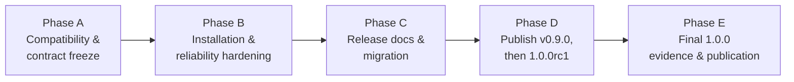

# Membrane Visual QC 1.0.0 implementation plan

This is the phased sequence that resolves every item in
[docs/releases/1.0.0_readiness.md](1.0.0_readiness.md). It does not itself perform the work --
each phase is a separate, later effort with its own PR(s). This document and the readiness matrix
are the only things this readiness programme produces, beyond the one live-verified blocker fix
described in the matrix (R-12) and its two regression tests.

## Overview

Phases are sequential in intent (each depends on the previous being substantially done) but B and C
can overlap in practice since they touch mostly disjoint files.

## Phase A -- Compatibility and contract freeze

**Entry criteria:** this readiness programme's audit is complete (it is, as of this document).

**Work:**
- R-1: pin `CSV_FIELDS` in `tests/test_contract_freeze.py`.
- R-2: document the undocumented status/error codes found in `status_vocabulary.md`.
- R-9: pin `membrane_vqc.__all__` in `tests/test_contract_freeze.py`.
- R-11: owner decision on the PDBTM/OPM identity-tolerance asymmetry (document or unify).
- Backfill `CHANGELOG.md`'s `[Unreleased]` section with PR #37 and PR #38 (see readiness §6).
- Write §5 of the readiness matrix ("Versioning and backward-compatibility policy for 1.x") into
  `docs/versioning_policy.md` proper, as concrete 1.x commitments rather than only living in the
  readiness matrix.

**Tests:** the new contract-freeze assertions (R-1, R-9) must fail if deliberately violated locally
before being confirmed to pass; full `pytest` green; `ruff check`/`ruff format --check` clean.

**Exit criteria:** every machine-readable contract this project ships has a regression test pinning
it (not just the ones that already did); `versioning_policy.md` states the exact 1.x freeze
boundary without needing to cross-reference the readiness matrix to know it.

## Phase B -- Installation and reliability hardening

**Entry criteria:** Phase A merged (not strictly blocking, but avoids rebasing test-file conflicts).

**Work:**
- R-3: fix the PDBTM-cache async-worker exception gap -- wrap `PdbtmWorkerOrchestrator`'s
  `inspect`/`fetch`/`use_cached_pair`/`clear` (or the four `_run_*` call sites in
  `pdbtm_gui_worker.py`) in the same `except Exception: return <safe failure>` pattern already
  proven in `comparison_worker.py:170-179`.
- R-6: add a `pytest-qt`-style dialog-reopen test (instantiate `MembraneVQCDialog` twice
  offscreen, assert no widget/timer leak).
- R-10: add `tests/test_ui_components_real_qt.py` to `stage4b-windows-core`'s explicit CI test list.
- R-4: extend `tests/test_plugin_upgrade.py`'s existing pattern to a v0.8.0 baseline (genuine-fixture
  diffing, cache round-trip, synthetic overlay mechanics), or make an explicit, documented decision
  not to build the harness and instead formally scope v0.8.0->1.0.0 as manual-verification-only.
- F-1: read-only/ACL-restricted install-directory test.
- F-2: AST-based static-analysis check that the packaged ZIP contains no dev-only imports.
- F-3: add `tests/test_batch_paths.py` to `stage4b-windows-core`'s CI list.
- F-4: propose and implement the `release-evidence-freeze` diff-guard CI check.
- F-8: add an `interface_width == 0` boundary test to `tests/test_planar_geometry.py`.
- F-9 through F-13: the remaining correctness/coverage gaps from the workflow audit (`allow_nan`
  consistency, `mvqc_slab`/`mvqc_color_hydropathy`/`mvqc_ligand_shell` exception-handling
  consistency and behavioral test coverage, batch-validation boundary tests, result-browser
  error-code fidelity).

**Tests:** every item above ships with its own new/extended automated test; full `pytest` green on
both the ubuntu `test` job and `stage4b-windows-core`.

**Exit criteria:** the one live-verified crash class found in this audit (R-12) has no known
siblings left uninvestigated; every packaging/install claim in the readiness matrix that was rated
"AUTOMATED" stays that way and every "NOT COVERED" item rated realistically automatable now has a
test.

## Phase C -- Release documentation and migration

**Entry criteria:** none strict; can start in parallel with Phase B.

**Work:**
- R-7: write the "Uninstalling" section.
- R-4 (doc half): rewrite `docs/upgrade_guide.md`'s scope header once Phase B's decision on the
  v0.8.0 harness is known.
- F-6: add the dependency/supply-chain-security paragraph to `docs/offline_and_safety.md`.
- F-7: add the missing v0.8.0 row to `docs/compatibility_matrix.md`'s schema/contract tables.
- F-5: add a short dev-environment note explaining the local-vs-CI real-PyMOL divergence
  (`docs/troubleshooting.md` or a new `docs/development_state.md` subsection).
- Prepare (but do not yet run) the v0.9.0 manual acceptance and v0.8.0-upgrade manual evidence
  templates, so Phase D can execute them immediately against a real build without re-deriving the
  checklist under time pressure.

**Tests:** `tests/test_documentation_consistency.py` extended where each new fact is checkable
(uninstall heading exists, upgrade-guide scope header names the correct version pair, etc.).

**Exit criteria:** every documentation gap identified in the readiness matrix's §6/§3 is closed;
nothing about installing, upgrading, or uninstalling this project requires reading source code or
asking a maintainer.

## Phase D -- Publish v0.9.0, then prepare 1.0.0rc1

This phase is split into two sub-steps because the readiness audit's evidence does not support
skipping straight to `1.0.0rc1` -- see the [readiness matrix's summary](1.0.0_readiness.md#summary)
for the full rationale. In short: PR #37 (the largest GUI change in this project's history) and
PR #38 have never been manually validated against real PyMOL, and no upgrade path from the only
published prerelease has ever been exercised. Every prior version in this project published its own
prerelease with a completed manual-acceptance record before the next phase of work began; this
phase restores that discipline before committing to the 1.0.0 label.

### D1 -- Publish v0.9.0

**Entry criteria:** Phases A-C complete and merged.

**Work:**
- Follow the existing two-PR release process (`docs/release_checklist.md`) exactly as it worked for
  v0.4.0 through v0.8.0: version-identity promotion `0.9.0.dev0` -> `0.9.0`, tag, publish as a
  GitHub prerelease with the standard 4 assets.
- Run `docs/manual_v0.9.0_ui_acceptance.md` (R-5) against the real, tagged v0.9.0 build -- all 6
  rounds, PASS/FAIL recorded with exact date and PyMOL distribution/version, following this
  project's established recording convention.
- Run the v0.8.0 -> v0.9.0 upgrade check (R-4's harness, if built in Phase B; manual smoke test at
  minimum otherwise) against the real published v0.8.0 asset.
- Freeze v0.9.0 evidence (`docs/v0.9.0_release_evidence.json`) exactly as done for prior releases.
- Reopen development as `0.9.1.dev0` or `1.0.0.dev0` depending on what Phase D2 planning finds (see
  below) -- this decision is deferred to when D1 actually completes, not decided now.

**Tests:** the existing `frozen-v0.9.0` mode added to `scripts/validate_release_artifacts.py`,
mirroring every prior version.

**Exit criteria:** v0.9.0 is a published GitHub prerelease with frozen evidence, a **completed**
(not merely prepared) manual UI acceptance record, and at least one verified upgrade path from
v0.8.0.

### D2 -- Cut 1.0.0rc1

**Entry criteria:** D1 complete. Any FAIL found during D1's manual acceptance run is fixed and
re-verified before proceeding -- a FAIL here means 1.0.0rc1 is not ready to cut, full stop.

**Work:**
- R-8: re-stamp `docs/v1.0_contract_freeze.md`'s audit-provenance header to the actual commit/version
  at the moment of the rc1 tag.
- Final read-through of the readiness matrix: confirm every REQUIRED BEFORE RC item is genuinely
  resolved (not just attempted).
- Version-identity promotion to `1.0.0rc1`.
- Publish as a GitHub prerelease, same asset set/process as every prior version.

**Tests:** full validation suite (as run throughout this programme); a fresh
`validate_release_artifacts.py --mode release-candidate --version 1.0.0rc1` pass.

**Exit criteria:** `1.0.0rc1` is published; every REQUIRED BEFORE RC item in the readiness matrix
shows status "resolved," not "not started."

## Phase E -- Final 1.0.0 evidence and publication

**Entry criteria:** `1.0.0rc1` has been available for a deliberate evaluation window (length is an
owner decision, not fixed here); every REQUIRED BEFORE FINAL item in the readiness matrix is
resolved; no new BLOCKER or REQUIRED BEFORE RC item was discovered during the rc1 window.

**Work:**
- Resolve any REQUIRED BEFORE FINAL item not already closed in Phases A-C.
- Freeze `docs/v1.0.0_release_evidence.json`.
- Version-identity promotion `1.0.0rc1` -> `1.0.0`.
- Publish the `1.0.0` GitHub release (still following this project's established prerelease-style
  publication process unless the owner decides 1.0.0 should be a non-prerelease GitHub release --
  that is an explicit decision to make at this point, not assumed here).
- Update `README.md`'s Development status section to reflect a stable 1.0.0, and update
  `CITATION.cff` to point at the new release per the existing "cite the latest published release"
  policy.

**Tests:** full validation suite; `validate_release_artifacts.py --mode frozen-v1.0.0` (new mode,
added the same way every prior `frozen-vX.Y.0` mode was added) passes on every subsequent commit
from this point forward, exactly like v0.4.0-v0.8.0 do today.

**Exit criteria:** `1.0.0` is published, evidence is frozen and independently re-verified
byte-identical (matching this project's established post-publication verification step), and every
item in the readiness matrix is either resolved, an accepted limitation, or explicitly deferred
post-1.0.

## What this plan deliberately does not do

Per the readiness audit's scope control: this plan does not itself bump the package version, redesign
the GUI, add scientific functionality, or create a tag/release. It is the sequence a future session
(or several) should follow, each phase as its own reviewed PR against `main`, not a single sweeping
change.
